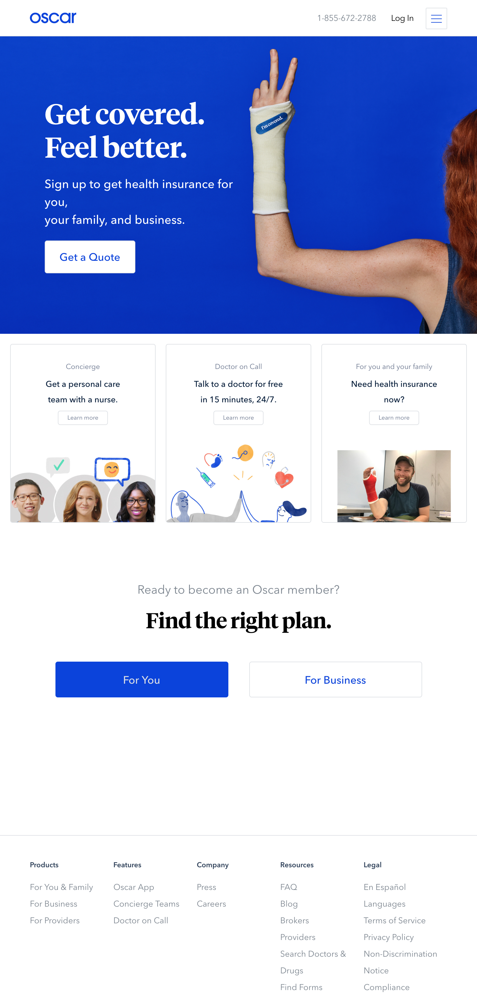

# Oscar Mockup

Your job will be to use Oscar's old website as a mockup and try to recreate it using HTML and CSS

## Getting Started

1. If you haven't alerady, fork and clone the `winter-break` repo then cd into this `oscar` directory
1. Create `index.html` and `styles.css` files. Don't forget to connect them. Work in these files to complete the mockup given below

## Notes

1. The images are in the `images` directory inside this oscar folder, except for the header. For that, just use a solid color background or use whatever image you like.
1. Don't worry about icons like facebook, twitter, youtube, instagram. As a stretch, use the inspector to see what they did and try to copy it.
1. Don't worry about matching the fonts the site uses. Just use `font-family: Arial` or `font-family: Times New Roman` or whatever you like.
1. Don't worry about rounded corners of buttons. If you can figure it out, great!
1. It's fine to guess at the colors
1. **The main thing we want you to focus on is the positioning/layout!**

---

*Copyright 2019, General Assembly Space. Licensed under [CC-BY-NC-SA, 4.0](https://creativecommons.org/licenses/by-nc-sa/4.0/)*
