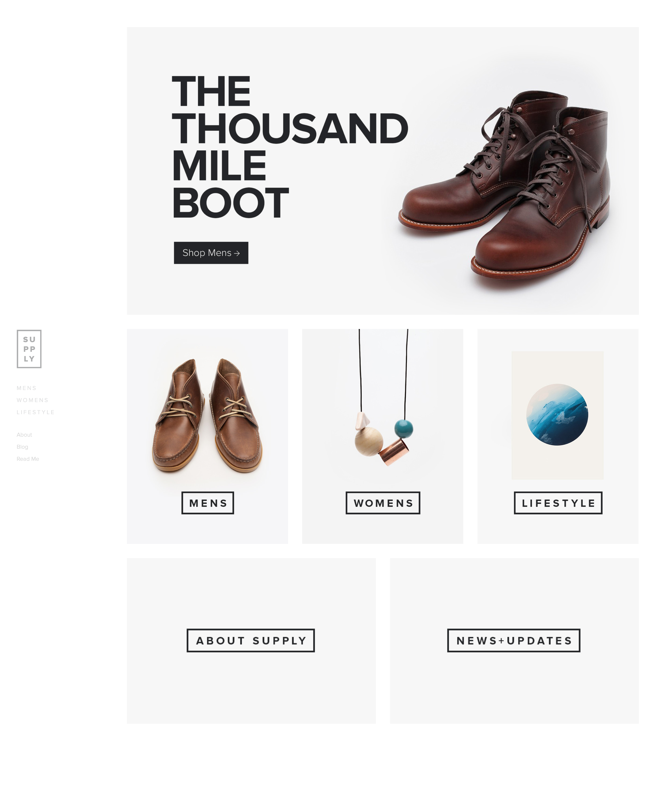

# Supply Mockup

## Getting Started

1. If you haven't alerady, fork and clone the `winter-break` repo then cd into this `supply` directory
2. Inside the `supply` directory, create `index.html` and `styles.css` files and make sure you connect them. Do your work in these files to recreate the mockup provided above
3. NOTE: All images you'll need to recreate the mockup are provided for you in the `img` folder
